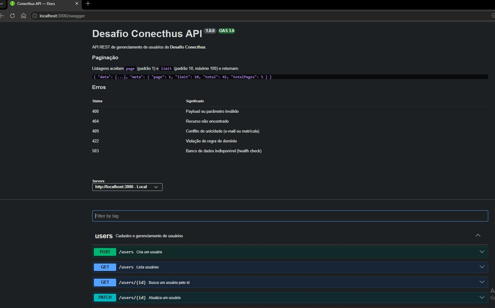
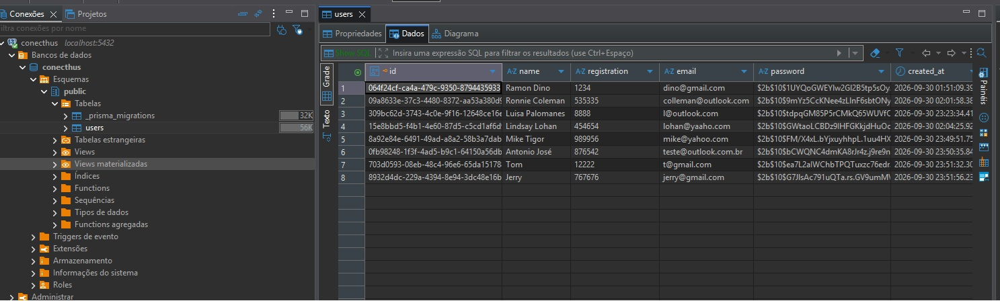

# WenLock — Desafio Full Stack Conecthus

Sistema **CRUD de gerenciamento de usuários**, com backend em **NestJS + Prisma + PostgreSQL** e frontend em **React + styled-components**, desenvolvido como avaliação prática para a vaga de Desenvolvedor Full Stack.

```
desafio_conecthus/
├── docker-compose.yaml   # sobe banco, API e frontend com um comando
├── backend/              # API REST — NestJS, Prisma, PostgreSQL, Swagger
├── frontend/             # Interface web — React, Vite, styled-components
└── imagens-app/          # capturas usadas neste README
```

## Início rápido

**Pré-requisito:** [Docker](https://www.docker.com/) com Docker Compose.

Na raiz do repositório:

```bash
docker compose up -d --build
```

| Serviço | Endereço                      | Descrição                         |
| ------- | ----------------------------- | --------------------------------- |
| `web`   | http://localhost:8080         | Frontend (nginx)                  |
| `api`   | http://localhost:3000         | API REST                          |
|         | http://localhost:3000/swagger | Documentação interativa (Swagger) |
|         | http://localhost:3000/health  | Saúde da API e do banco           |
| `db`    | `localhost:5432`              | PostgreSQL 17                     |

As migrations do banco são aplicadas automaticamente quando a API inicia.

### Comandos úteis

```bash
docker compose ps                 # status dos containers
docker compose logs -f api        # logs da API
docker compose up -d --build web  # recriar só o frontend após mudanças
docker compose down               # parar tudo (os dados do banco são mantidos)
```

> ⚠️ `docker compose down -v` também apaga o volume do banco, **removendo todos os dados**.

## Documentação da API (Swagger)

Com a API rodando, acesse **http://localhost:3000/swagger**. Lá estão todos os endpoints, com exemplos de requisição e resposta, os códigos de erro e o botão "Try it out" para testar direto pelo navegador. O OpenAPI também está disponível em `/swagger-json` e `/swagger-yaml`.



## Banco de dados

Para inspecionar os dados com DBeaver, pgAdmin ou outro cliente:

| Campo   | Valor       |
| ------- | ----------- |
| Host    | `localhost` |
| Porta   | `5432`      |
| Banco   | `conecthus` |
| Usuário | `postgres`  |
| Senha   | `postgres`  |

Os dados ficam em `public.users`. A senha é salva apenas como hash bcrypt, e usuários excluídos continuam na tabela com `deleted_at` preenchido (soft delete).



## Testes

### Backend

Os testes unitários não precisam de banco. Os e2e sobem a aplicação inteira contra um PostgreSQL real, usando um banco separado (`conecthus_test`, definido em `backend/.env.test`). As migrations desse banco são aplicadas automaticamente antes dos testes.

```bash
cd backend
npm install

# unitários: entidade, validações e casos de uso
npm test

# e2e: precisam do PostgreSQL rodando
docker compose -f ../docker-compose.yaml up -d db
npm run test:e2e

# cobertura dos unitários
npm run test:cov
```

### Frontend

Testes com Vitest + Testing Library para o schema Zod, o formulário e a listagem. A API é mockada, então não é preciso subir o backend.

```bash
cd frontend
npm install

npm test             # roda uma vez
npm run test:watch   # modo observação
```

## Desenvolvimento

Para rodar backend e frontend fora do Docker, com hot reload:

```bash
# 1. banco no Docker
docker compose up -d db

# 2. API (http://localhost:3000)
cd backend
cp .env.example .env
npm install
npm run prisma:deploy
npm run start:dev

# 3. frontend (http://localhost:5173), em outro terminal
cd frontend
cp .env.example .env
npm install
npm run dev
```

Detalhes de arquitetura, regras, testes e scripts de cada parte:

- 📘 [backend/README.md](backend/README.md)
- 📗 [frontend/README.md](frontend/README.md)
